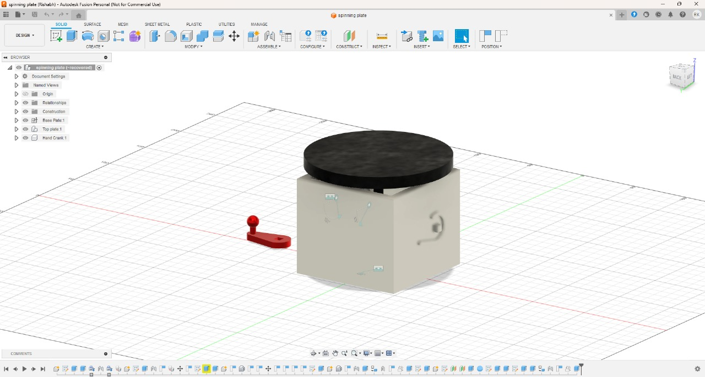
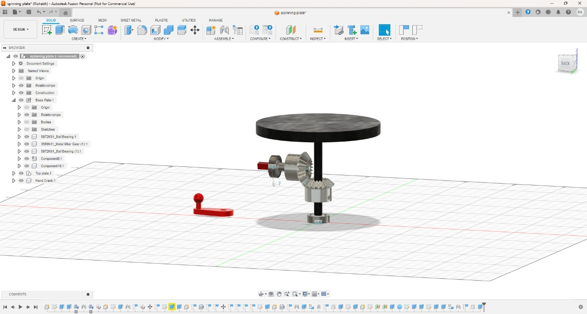

# Spinning-Display-CAD

## Overview
This is a functional mechanical display made in Fusion 360 using module 1.5 bevel gears with a mounting distance of 30mm. It features a detatchable hand crank that can be stored in the back of the box for storage of the hand crank. The internals are housed within an 8x8x8cm base

---

## ⚙️ Key Design Features

* Hand Powered Rotation
* Bevel gear system mounted at 90 degree angle
* Storage spot for hand crank
* 12cm display plate

---

## Preview
#### Front View  

#### Back View  

#### Internal Gear Mechanism  

---

## Problems Faced
+ ### Bevel Gear selection
  To understand how to use bevel gears in my project i had to reaerch: module sizes, pressure angles, and backlash.
+ ### Plate Support
  I had to balance shaft size and learn about bearing tolerances to pick the right one
+ ### Creating a visual animation
  To create an animation of the gears moving together, i had to understand and impliment motion links in fusion 360
---

## Future Improvements
- #### Better Overrall stabily: add more supports to the main shaft and hand crank shaft
- #### Change hand crank to display gear ratio to 3
- #### Add motor mount option to replace crank
- #### Make one wall of the box replacable for quick repairs
