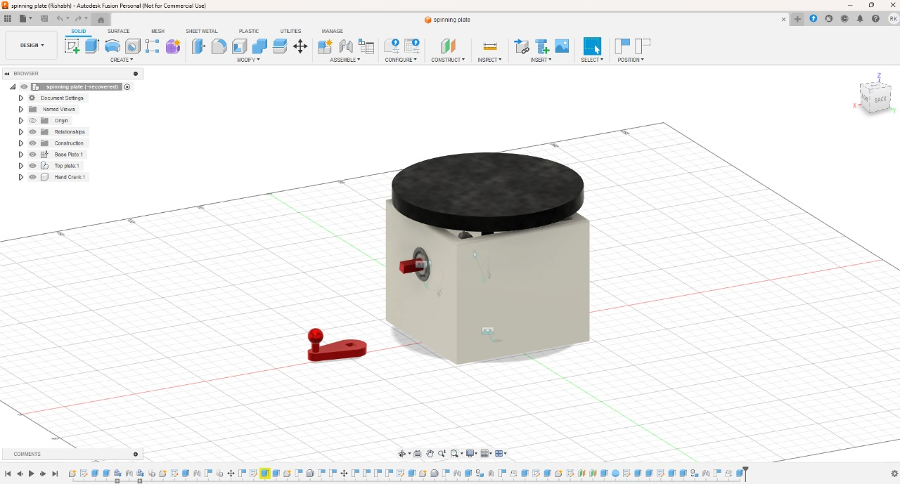

# Spinning Display CAD

## 📌 Overview
This is a functional mechanical display modeled in Fusion 360, featuring **module 1.5 bevel gears** with a **30 mm mounting distance**.  
It includes a **detachable hand crank** that fits into a built-in rear storage slot. The mechanism is compactly housed in an **8 × 8 × 8 cm base**, driving a **12 cm display plate**.

---

## ⚙️ Key Design Features

- Hand-powered rotation via removable crank
- Bevel gear system at 90° for compact motion transfer
- Rear slot for crank storage
- 12 cm top display plate

---

## 📷 Preview

#### 🔸 Front View  

#### 🔸 Back View  

#### 🔸 Internal Gear Mechanism  

---

## 🧠 Problems Faced & Learnings

- **Bevel Gear Selection**  
  I had to research gear terminology like module size, pressure angle, and backlash to select a gear pair that meshed correctly and fit inside the housing.

- **Plate Support and Bearing Fit**  
  Finding the right shaft and bearing combination required learning about **bearing tolerances** and how to minimize friction while maintaining plate stability.

- **Creating an Animation**  
  To visualize gear interaction, I had to understand and implement **motion links** in Fusion 360. This included setting up joints and simulating motion paths.

---

## 🔧 Future Improvements

- Improve overall stability by adding support for the crank and center shaft
- Change gear ratio from 1:1 to 3:1 for smoother display rotation
- Add an optional motor mount in place of the crank
- Make one wall removable for easier access and maintenance

